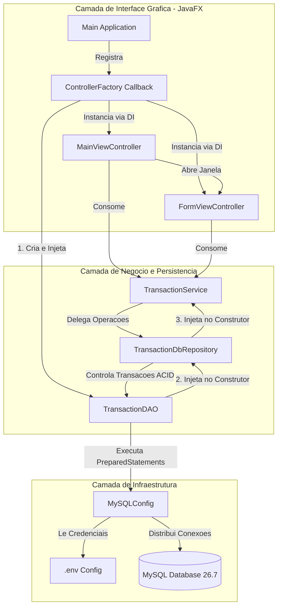

# Diagrama de Arquitetura do Novo Sistema (C4 Model)

Este diagrama de componentes ilustra a topologia atualizada do ecossistema do aplicativo, evidenciando o fluxo de dados reativo entre a interface grafica JavaFX e as camadas desacopladas de negocio e persistencia:

