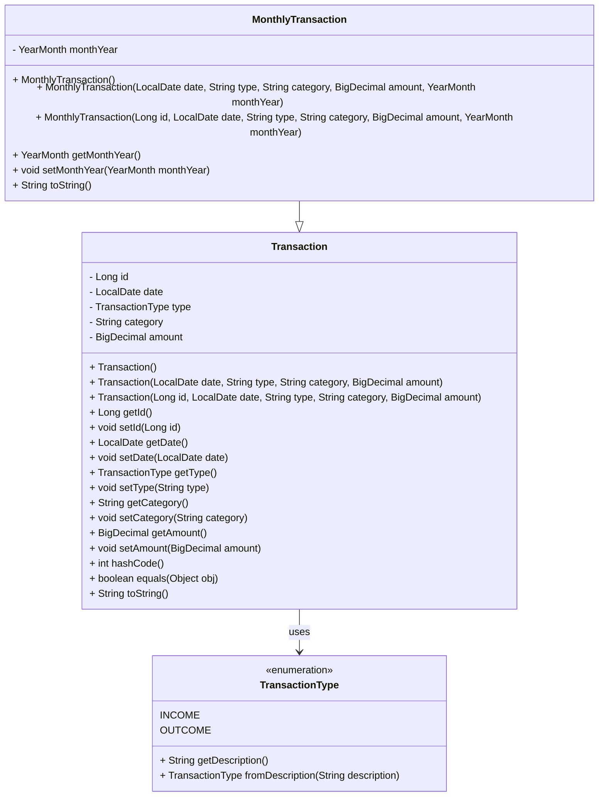

# Modelagem de Dados do Banco de Dados (MySQL)

Este diagrama representa a estrutura de classes que mapeia diretamente a tabela transactions persistida no banco de dados MySQL, com suporte ao identificador unico por chave primaria e heranca via Tabela Unica (Single Table):

