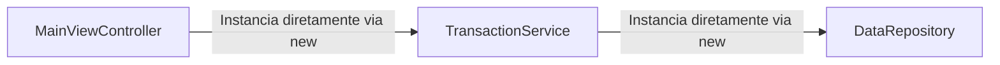
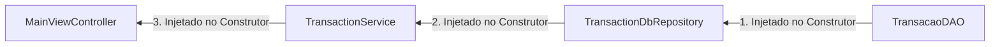
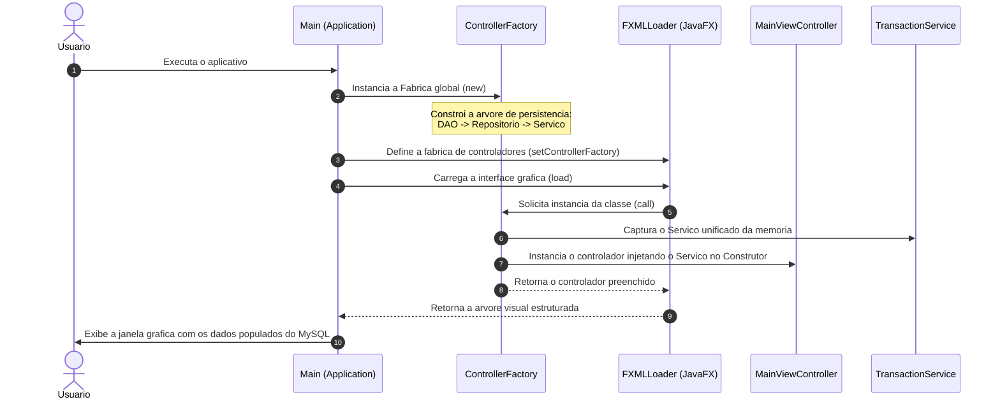

# Padroes de Projeto Utilizados

## 1. Inversao de Dependencia (Dependency Injection - DI)

Nas abordagens tradicionais de acoplamento forte, as classes de controle ou de servicos instanciam suas proprias dependencias de forma interna por meio do operador `new`. Isso inviabiliza a realizacao de testes unitarios isolados e viola o principio de responsabilidade unica do SOLID.

Na arquitetura atual do FinTrack, aplica-se a **Inversao de Dependencia pura via Construtor**. Os componentes nao criam suas dependencias, eles as exigem em seus metodos construtores. O `TransactionService` requer a interface `GenericRepository` no construtor. Por sua vez, o `TransactionDbRepository` requer a instancia fisica do `TransactionDAO` por construtor.

### Fluxo de Dependencia Classico (Antes)



### Fluxo de Inversao de Dependencia via Construtor (Depois)



### Antes (Acoplamento Forte)
O controlador instaciava diretamente a persistencia em memoria e gerava dependencias amarradas:
```java
public class MainViewController {
    private TransactionService service;

    @FXML
    public void initialize() {
        // Acoplamento direto via operador new
        this.service = new TransactionService(new DataRepository<>());
    }
}
```

### Depois (Inversao de Dependencia)
O controlador recebe a instancia pronta do servico no construtor, sem saber como ele funciona ou onde os dados sao salvos:
```java
public class MainViewController {
    private final TransactionService service;

    // Dependencia injetada ativamente via construtor
    public MainViewController(TransactionService service) {
        this.service = service;
    }
}
```

---

## 2. Centralizacao com Factory Pattern (ControllerFactory)

Por padrao, o ciclo de vida e a inicializacao dos controladores do JavaFX (`MainViewController` e `FormViewController`) sao controlados internamente pelo framework ao ler os arquivos estruturais `.fxml`. Isso impoe a limitacao de que tais classes possuam um construtor publico vazio, impedindo o uso de injecao de dependencias.

Para sanar este problema e unificar as instancias, foi implementada a classe **`ControllerFactory`**, que assina a interface funcional `Callback<Class<?>, Object>` do JavaFX. Essa fabrica e registrada no ponto de inicializacao do sistema (`Main.java`) e constroi o grafo de dependencias da persistencia de tras para frente.

### Diagrama de Sequencia da Inicializacao e Injecao por Fabrica



### Antes (Carregamento Padrao do Framework)
O JavaFX gerenciava o carregamento e exigia construtores sem argumentos, forcando a criacao manual de servicos:
```java
FXMLLoader loader = new FXMLLoader(getClass().getResource("/app/view/main-view.fxml"));
Parent root = loader.load(); // Invoca internamente o construtor vazio da Controller
```

### Depois (Interceptacao via ControllerFactory)
A fabrica centraliza a montagem das camadas e intercepta o carregamento para entregar o controlador ja preenchido via construtor:
```java
public class ControllerFactory implements Callback<Class<?>, Object> {
    private final TransactionService service;

    public ControllerFactory() {
        // Montagem do grafo de dependencias de tras para frente
        TransacaoDAO dao = new TransacaoDAO();
        TransactionDbRepository repository = new TransactionDbRepository(dao);
        this.service = new TransactionService(repository);
    }

    @Override
    public Object call(Class<?> param) {
        if (param == MainViewController.class) {
            return new MainViewController(service); // Injeta o servico unificado
        }
        if (param == FormViewController.class) {
            return new FormViewController(service);
        }
        try {
            return param.getDeclaredConstructor().newInstance();
        } catch (Exception e) {
            throw new FactoryInstantiationException("Erro na instanciacao da Factory", e);
        }
    }
}
```
