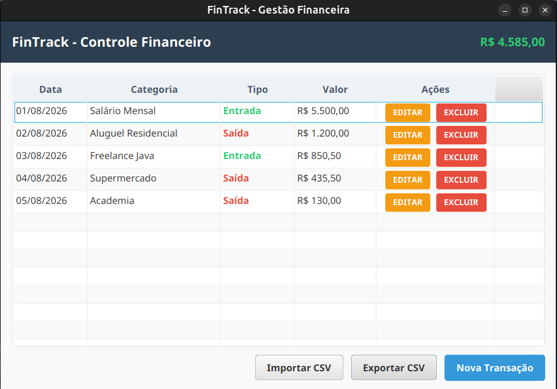
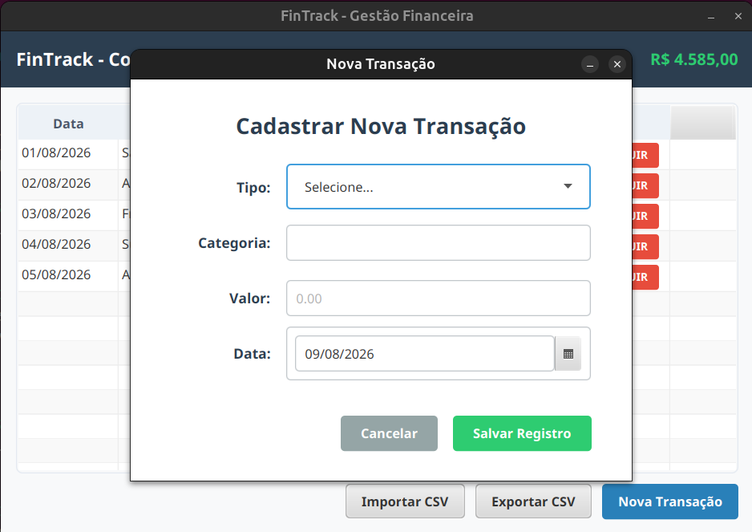

# Interfaces e Funcionalidades do Aplicativo

Este documento descreve as telas que compõem a interface gráfica do FinTrack, detalhando os componentes visuais do JavaFX e o fluxo de comunicação com as camadas de negócio e persistência.

---

## 1. Tela Principal (Dashboard Financeiro)

A tela principal centraliza a visualização das movimentações e o balanço consolidado do usuário, operando de forma reativa com o banco de dados.

### Componentes e Comportamentos Visuais
* **Painel de Saldo Geral:** Exibe o saldo total consolidado. O valor é calculado de forma polimórfica pelo `TransactionService` somando as entradas e subtraindo as saídas, sendo renderizado com a máscara de moeda nacional (`R$`) fornecida pelo utilitário `Formatter`.
* **Tabela de Transações (TableView):** Lista os registros recuperados do MySQL por meio do `TransactionDbRepository`. As colunas utilizam expressões lambda para mapear os dados do `TransactionResponseDTO` e aplicam fábricas de células customizadas (`setCellFactory`) para exibir datas (`dd/MM/yyyy`) e valores (`R$`) nos padrões nacionais.
* **Coluna de Ações:** Cada linha da tabela possui dois botões específicos:
  * **EDITAR:** Captura o DTO da linha selecionada e invoca a abertura da janela de formulário repassando a referência para alteração.
  * **EXCLUIR:** Dispara a remoção física do registro diretamente no banco de dados utilizando a chave primária (`Long id`). O fluxo é protegido por controle transacional ACID, atualizando o saldo e a tabela instantaneamente após a confirmação.
* **Barra de Ações do Rodapé:** Posiciona três componentes estruturados para o controle do ciclo de vida dos dados:
  * **Importar CSV:** Invoca um `FileChooser` nativo para abrir arquivos planos. O texto capturado é enviado ao `TransactionCsvParser` para deserialização e inserido em lote atômico no banco via `saveAll`.
  * **Exportar CSV:** Dispara uma caixa de salvamento de arquivos para exportar a listagem atual em texto estruturado delimitado por ponto e vírgula (`;`), isolando as falhas por meio da exceção customizada `CsvSerializationException`.
  * **Nova Transação:** Abre a janela modal de formulário limpa para a criação de novos registros.

---

## 2. Tela de Formulário (Nova Transação e Edição)

Esta janela é aberta de forma modal (`APPLICATION_MODAL`), bloqueando a interação com a tela de fundo até que a operação atual seja concluída ou cancelada.

### Componentes e Fluxo de Validação
* **Tipo de Transação (ComboBox):** Permite selecionar estritamente as opções "Entrada" ou "Saída", mapeadas internamente para o enumerador `TransactionType`.
* **Categoria e Data (TextField e DatePicker):** Campos de preenchimento obrigatório. Ao carregar um registro para edição, o `DatePicker` e os campos de texto são populados automaticamente com os dados do DTO de resposta recuperado por ID.
* **Valor da Movimentação (TextField):** Suporta a digitação com vírgula (padrão nacional). O método `handleSave()` intercepta o clique em salvar, normaliza o caractere substituindo a vírgula por ponto e encapsula o valor em um tipo `BigDecimal`.
* **Mecanismo de Intercepção de Erros:**
  * Se houver campos em branco ou se o valor numérico for inválido ou menor/igual a zero, o controlador interrompe o processo, lança a exceção customizada `InvalidInputException` e abre um alerta visual (`Alert`) do tipo `WARNING` na tela do usuário sem vazar metadados do sistema.
  * Se os dados estiverem corretos, o sistema identifica se é um novo registro (`service.save()`) ou uma edição (`service.update()`), enviando um `TransactionRequestDTO` para o serviço e confirmando as alterações antes de recarregar a listagem e fechar a janela.
